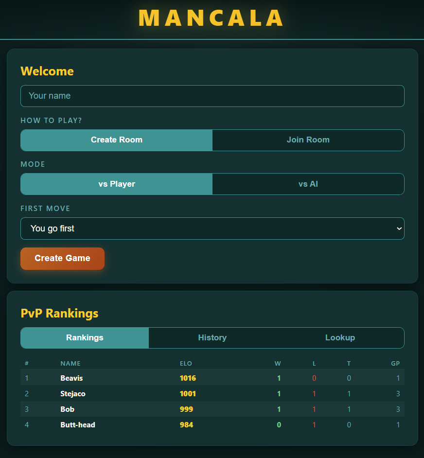
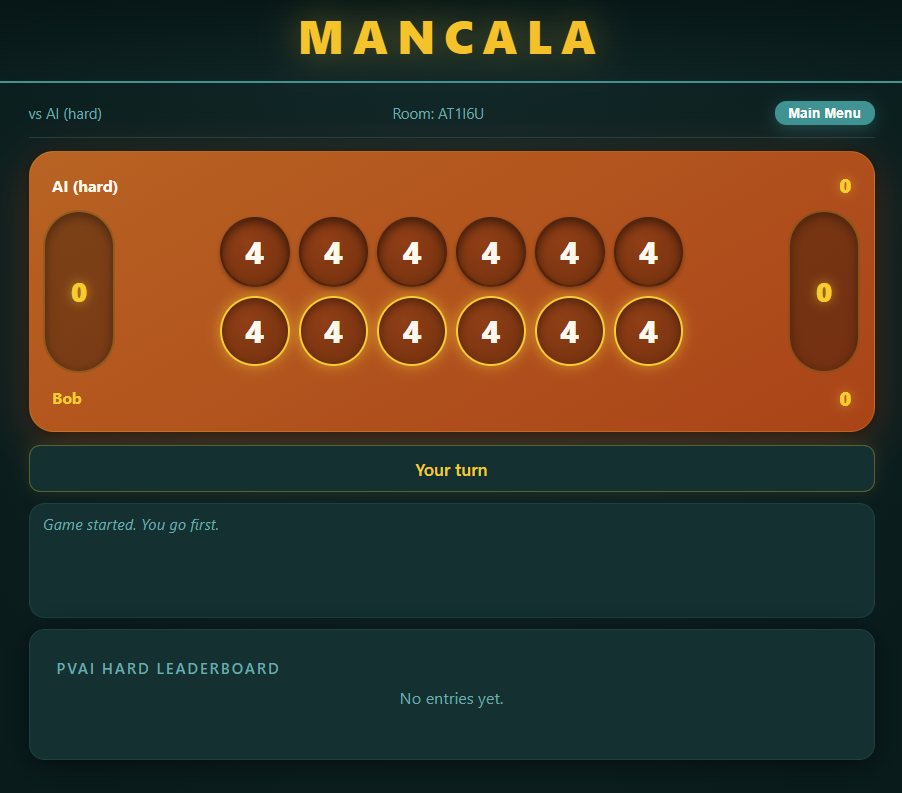

# Mancala Live

A real-time multiplayer Mancala web game built with Flask + Socket.IO. Play against an AI (three difficulty levels) or another human in a private room, with persistent leaderboards backed by PostgreSQL.

Live at: https://mancala-live.onrender.com (or wherever you've deployed it)

---

## Screenshots

| Lobby with PvP Rankings | In-game vs AI (Hard) |
|---|---|
|  |  |

---

## Features

- **PvP rooms** — create a room, share the 6-character code, your friend joins
- **AI opponent** — three difficulties (Easy = random, Medium = depth-3 minimax, Hard = depth-7 alpha-beta)
- **In-game chat** — PvP only
- **Series tracking** — wins/losses accumulate across rematches in the same room
- **PvAI Leaderboard** — submit your record after an AI series (filterable by difficulty)
- **PvP ELO system** — auto-saved every game with rankings, full game history, and per-player lookup (K-factor 32, starting ELO 1000)
- **In-game leaderboard** — small top-5 panel below the chat, showing whichever leaderboard is relevant to the current mode
- **Smooth board animations** — stones drop one at a time with capture flashes and extra-turn highlights
- **Mobile-friendly** — responsive layout, board scales to viewport

---

## Tech stack

- **Backend:** Python 3.11+, Flask, Flask-SocketIO (threading mode), psycopg2 (PostgreSQL) with SQLite fallback for local dev
- **Frontend:** Vanilla JavaScript (no framework), HTML, CSS
- **Real-time:** Socket.IO over WebSocket
- **Hosting:** Render (web service + free PostgreSQL)

---

## Project structure

```
mancala/
├── app.py                  # Flask + SocketIO server, rooms, routes, socket events
├── game.py                 # MancalaGame class and board constants
├── ai.py                   # Minimax + alpha-beta pruning AI
├── db.py                   # DB connection, schema init, ELO, PvP recording
├── requirements.txt
├── Procfile                # Render entry point
├── templates/
│   └── index.html          # Single-page UI shell (lean — references external CSS/JS)
└── static/
    ├── css/
    │   └── main.css        # All styles
    └── js/
        ├── constants.js    # Board indices, pit/store maps
        ├── socket-init.js  # Socket connection + sleep helper
        ├── state.js        # Mutable global state (S, animation flags, etc.)
        ├── ui.js           # Screen management, lobby actions, error display
        ├── board.js        # Board build, render, animation, game-over overlay
        ├── chat.js         # Chat send/receive
        ├── leaderboard.js  # PvAI + PvP leaderboard, history, player lookup
        ├── socket-events.js # All socket.on(...) handlers
        └── main.js         # Event listener wiring + initial data load
```

---

## How Mancala is implemented

The board is a 14-cell array:
- Indices 0–5 → Player 1's pits (left to right from P1's view)
- Index 6 → Player 1's store
- Indices 7–12 → Player 2's pits
- Index 13 → Player 2's store

On every move the server:
1. Picks up all stones from the selected pit, sows them counter-clockwise (skipping the opponent's store)
2. Grants an **extra turn** if the last stone lands in the player's own store
3. **Captures** if the last stone lands in an empty pit on the player's side — the captured stones plus the opposite pit's stones go to the player's store
4. **Sweeps** remaining stones to the appropriate store when one side is empty, then declares the winner

All game state lives on the server (`MancalaGame` in `game.py`); the client only renders.

---

## Setup

### Local development

```bash
git clone https://github.com/rwaynewhite15/mancala-live.git
cd mancala-live
pip install -r requirements.txt
python app.py
```

Open http://localhost:5000.

Without `DATABASE_URL` set, the app uses SQLite (`leaderboard.db` in the project root) — fine for local testing.

### Production (Render)

1. **Create a Render web service** pointing at your fork of this repo. Render auto-detects the `Procfile`:
   ```
   web: python app.py
   ```

2. **Create a PostgreSQL database** in the same Render account (free tier is sufficient).

3. **Add the `DATABASE_URL` environment variable** to your web service:
   - Render dashboard → your web service → Environment → Add Environment Variable
   - Key: `DATABASE_URL`
   - Value: paste the **Internal Database URL** from the PostgreSQL service's Connections tab

4. Render redeploys automatically. `db.py` runs `_init_db()` on startup, which creates the `leaderboard`, `players`, and `pvp_games` tables via `CREATE TABLE IF NOT EXISTS` — no manual SQL needed.

The app also accepts older-format `postgres://` URLs and normalizes them to `postgresql://` for psycopg2.

---

## Database schema

Three tables, all created automatically by `_init_db()`:

**`leaderboard`** — manually-submitted PvAI series records
```
id, name, difficulty, wins, losses, ties, submitted_at
```

**`players`** — auto-managed PvP profiles (one row per unique name, case-insensitive)
```
id, name, display_name, elo, wins, losses, ties, games_played
```

**`pvp_games`** — auto-logged every time a PvP game ends
```
id, p1_name, p2_name, p1_display, p2_display,
p1_stones, p2_stones, winner_name,
p1_elo_before, p2_elo_before, p1_elo_after, p2_elo_after,
p1_elo_change, p2_elo_change, played_at
```

---

## ELO system

PvP games use standard ELO with K-factor 32 and starting rating 1000.

```
Expected score:  Ea = 1 / (1 + 10^((Rb - Ra) / 400))
New rating:      Ra' = Ra + K * (Sa - Ea)
```

Where `Sa` is 1 for a win, 0 for a loss, 0.5 for a tie. Both players' ratings update after every game — `db.py:_calc_elo` does the math, `db.py:_record_pvp_game` performs an UPSERT on the players table and inserts a row into `pvp_games`.

---

## Connecting to the database

To inspect production data:

```bash
psql -h <host>.oregon-postgres.render.com -p 5432 -U <user> <dbname>
```

You'll be prompted for the password from Render's Connections tab. Useful queries:

```sql
-- Top ELO
SELECT display_name, elo, wins, losses, ties, games_played
FROM players ORDER BY elo DESC LIMIT 10;

-- Recent PvP games
SELECT p1_display, p2_display, p1_stones, p2_stones, winner_name, played_at
FROM pvp_games ORDER BY played_at DESC LIMIT 20;

-- AI leaderboard
SELECT name, difficulty, wins, losses, ties
FROM leaderboard ORDER BY wins DESC LIMIT 20;
```

---

## HTTP routes

| Method | Path | Description |
|---|---|---|
| GET | `/` | Main UI |
| GET | `/leaderboard?difficulty=easy\|medium\|hard` | Top 20 PvAI entries (optionally filtered) |
| POST | `/submit_score` | Submit PvAI series record (JSON: `name, difficulty, wins, losses, ties`) |
| GET | `/pvp/rankings` | Top 20 players by ELO |
| GET | `/pvp/history` | Last 50 PvP games |
| GET | `/pvp/player/<name>` | Player profile + their last 20 games |

## Socket events

**Client → server:** `create_room`, `join_room_request`, `move`, `chat`, `rematch`, `disconnect`

**Server → client:** `joined`, `waiting`, `state`, `new_game`, `chat`, `error`, `opponent_left`

State broadcasts include a monotonic `state_seq` so the client can ignore out-of-order updates from the AI thread.

---

## Environment variables

| Name | Required | Description |
|---|---|---|
| `DATABASE_URL` | Production | PostgreSQL connection string from Render |
| `SECRET_KEY` | Recommended | Flask session secret (defaults to dev value if unset) |
| `PORT` | No | HTTP port (defaults to 5000) — Render sets this automatically |

---

## License

MIT
